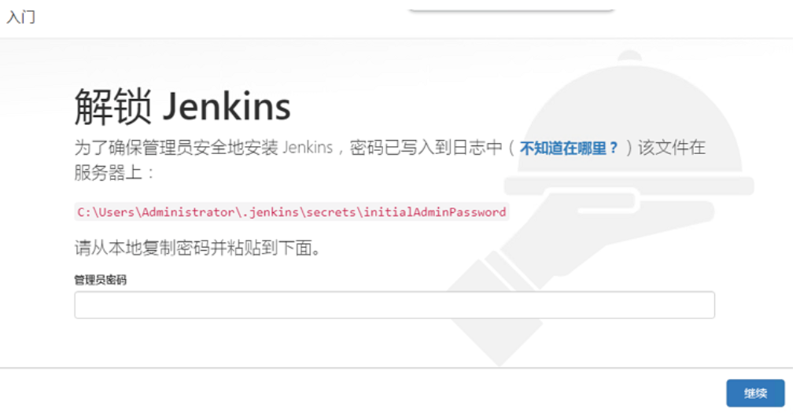
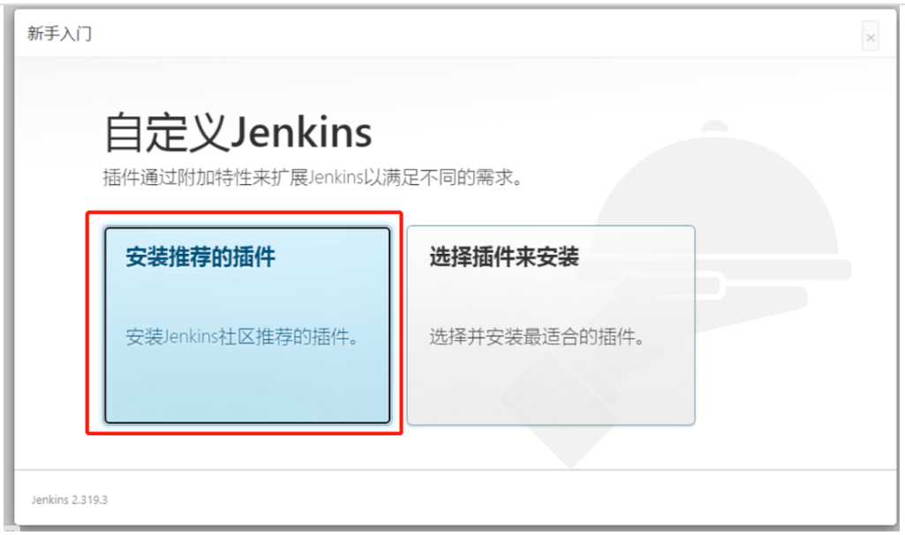
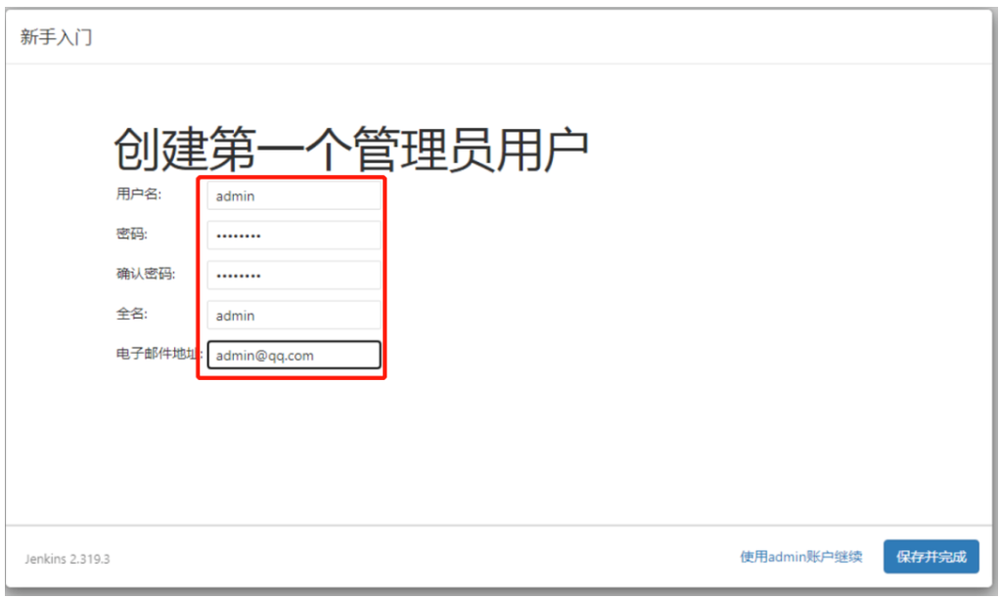

# 1. 安装 jdk8.0 

- 下载jdk8.0

```
https://ftp-new-pc.pconline.com.cn/pub/download/201903/pconline1552198052014.zip?md5=Dv6EA6OPkM2TLsDT27GYXw&expires=1646537688
```

下载下来是一个exe文件，直接点击一步一步安装即可。如果要安装到别的目录的话，选择对应的目录即可。这里安装到

```
C:\jenkins\jdk1.8
```

- 配置环境变量

JVAV_HOME

```
JAVA_HOME=C:\jenkins\jdk1.8
```

PATH

```
path=%PATH%;C:\jenkins\jdk1.8\bin
```

# 2. 安装Tomcat 8.x

- 下载 Tomcat 8.5

```
https://tomcat.apache.org/download-80.cgi
```

- 安装

直接解压到对应的目录即可，这里解压到

```
C:\jenkins\tomcat-8.5
```

# 3. 安装 Jenkins

- 下载

```
https://mirrors.tuna.tsinghua.edu.cn/jenkins/war-stable/2.319.3/jenkins.war
```

- 安装jenkins.war

把 jenkins.war 拷贝到Tomcat的安装目录

```
C:\jenkins\tomcat-8.5\webapps
```

- 启动Tomcat

点击启动脚本

```
C:\jenkins\tomcat-8.5\bin\startup.bat
```

如果点击时，出现一闪而过，说明启动失败。可以按照如下方式查看问题，打开一个cmd命令行窗口，然后执行

```
C:\jenkins\tomcat-8.5\bin\startup.bat
```

如果出现是以下的错误

```
C:\jenkins\tomcat-8.5\bin>startup.bat
Neither the JAVA_HOME nor the JRE_HOME environment variable is defined
At least one of these environment variable is needed to run this program
C:\jenkins\tomcat-8.5\bin>
```

修改一下启动脚本，添加一行 **set JAVA_HOME=C:\jenkins\jdk1.8** ; 大致的位置如下

```
setlocal

rem Guess CATALINA_HOME if not defined
set JAVA_HOME=C:\jenkins\jdk1.8
```

再次执行 startup.bat 启动脚本，就ok了。**启动完毕后，在启动日志窗口可以看到如下信息，记录下来**

```
Please use the following password to proceed to installation:

cd929f2ca9f4462e99a1dde6990d8977

This may also be found at: C:\Users\Administrator\.jenkins\secrets\initialAdminP
assword

*************************************************************
*************************************************************
*************************************************************
```

然后，使用以下关闭脚本，先对Tomcat关闭一次。同样也有可能遇到与启动脚本一样的问题。按照相同的思路添加JAVA_HOME变量解决即可

```
C:\jenkins\tomcat-8.5\bin\shutdown.bat
```

把以下目录的 jenkins.war 删除

```
C:\jenkins\tomcat-8.5\webapps\
```

因为第一次启动时，jenkins.war 已经被加压成目录，避免每次启动都重复解压，所以直接把 jenkins.war 删除了即可。删除后再次启动Tomcat

# 4. 配置 Jenkins

- 访问jenkins

```
http://127.0.0.1:8080/jenkins
```



找到上图的文件，并打开；把密码填入，然后继续即可

```
C:\Users\Administrator\.jenkins\secrets\initialAdminPassword
```

接下来，直接选择 **安装推荐的插件** 即可。等待安装完毕



配置管理员，管理员的名字一般起为 admin；录入后，点击**保存并完成**



接下来后续步骤就，直接单击 **保存并完成** 即可。最终就安装完成 jenkins了，访问地址如下：

```
http://127.0.0.1:8080/jenkins/
```