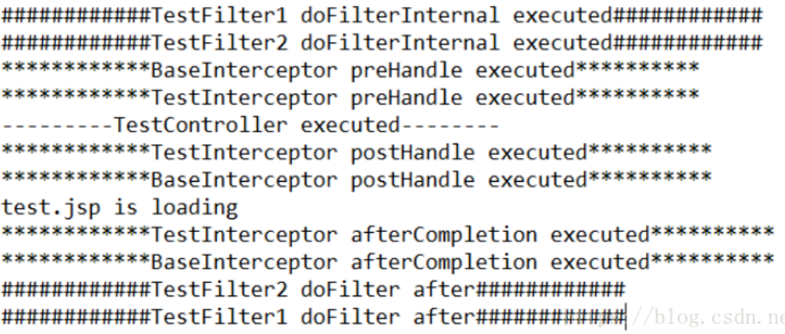
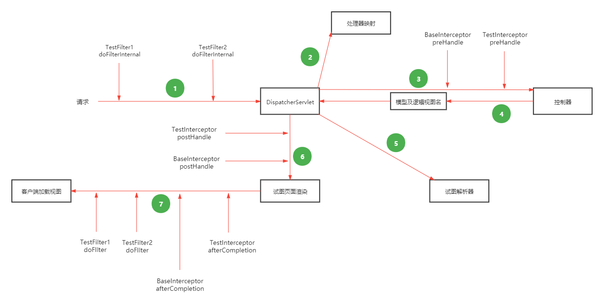
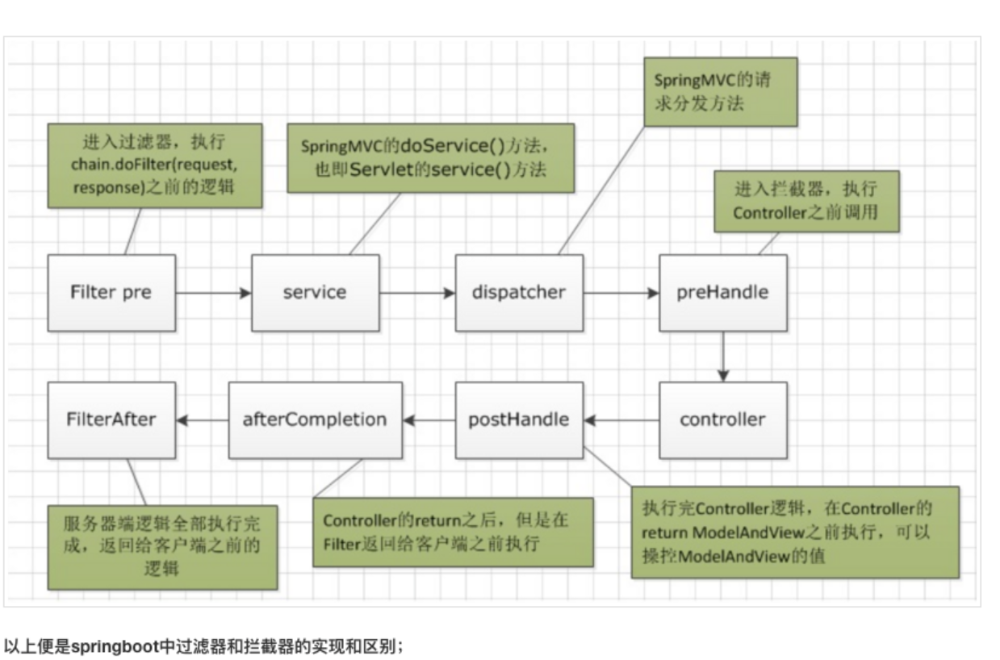

### 过滤器（Filter）
它依赖于servlet容器。它可以对几乎所有请求进行过滤。使用过滤器的目的，是用来做一些过滤操作，获取我们想要获取的数据，比如：在Javaweb中，对传入的request、response提前过滤掉一些信息，或者提前设置一些参数，然后再传入servlet或者Controller进行业务逻辑操作。

通常用的场景是：在过滤器中修改字符编码（CharacterEncodingFilter）、在过滤器中修改HttpServletRequest的一些参数（XSSFilter(自定义过滤器)），如：过滤低俗文字、危险字符等。

### 拦截器（Interceptor）

它依赖于web框架，在SpringMVC中就是依赖于SpringMVC框架。在实现上，基于Java的反射机制。

属于面向切面编程（AOP）的一种运用，就是在service或者一个方法前，调用一个方法，或者在方法后，调用一个方法，比如动态代理就是拦截器的简单实现，在调用方法前打印出字符串（或者做其它业务逻辑的操作），也可以在调用方法后打印出字符串，甚至在抛出异常的时候做业务逻辑的操作。

由于拦截器是基于web框架的调用，因此可以使用Spring的依赖注入（DI）进行一些业务操作，同时一个拦截器实例在一个controller生命周期之内可以多次调用。拦截器可以对静态资源的请求进行拦截处理。

测试结果，并访问：
```
http://www.localhost:8080/test
```

看控制台的输出



从这个控制台打印输出，就可以很清晰地看到有多个拦截器和过滤器存在时的整个执行顺序了。当然，对于多个拦截器它们之间的执行顺序跟在SpringMVC的配置文件中定义的先后顺序有关。

总结
对于上述过滤器和拦截器的测试，可以得到如下结论：
- Filter需要在web.xml中配置，依赖于Servlet
- Interceptor需要在SpringMVC中配置，依赖于框架
- Filter的执行顺序在Interceptor之前，具体的流程见下图






**两者的本质区别：**

拦截器（Interceptor）是基于Java的反射机制，而过滤器（Filter）是基于函数回调。从灵活性上说拦截器功能更强大些，Filter能做的事情，都能做，而且可以在请求前，请求后执行，比较灵活。Filter主要是针对URL地址做一个编码的事情、过滤掉没用的参数、安全校验（比较泛的，比如登录不登录之类），太细的话，还是建议用interceptor。不过还是根据不同情况选择合适的。
